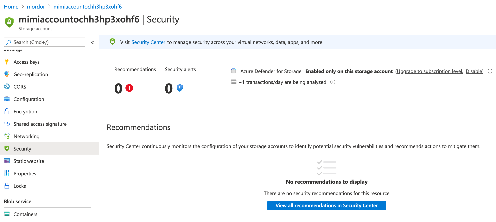
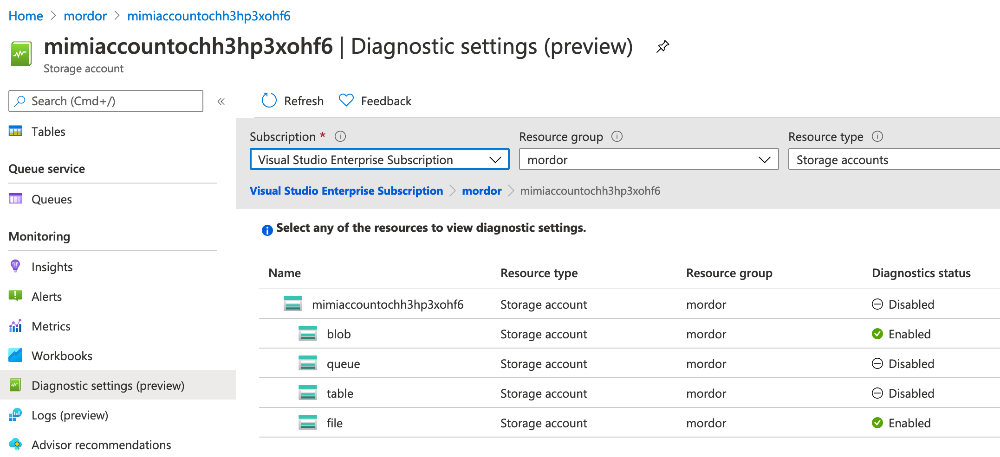

# Storage Account & Private Container

[](https://portal.azure.com/#create/Microsoft.Template/uri/https%3A%2F%2Fraw.githubusercontent.com%2FOTRF%2FBlacksmith%2Fmaster%2Ftemplates%2Fazure%2FStorage-Account-Private-Container%2Fazuredeploy.json) [](http://armviz.io/#/?load=https%3A%2F%2Fraw.githubusercontent.com%2FOTRF%2FBlacksmith%2Fmaster%2Ftemplates%2Fazure%2FStorage-Account-Private-Container%2Fazuredeploy.json)

## Enable Azure Defender for Storage & Diagnostic Logging

You can run this template and enable Azure Defender for Storage and Diagnostic Logging for Blog and File resources

```
az deployment group create -f ./azuredeploy.json -g mordor --parameters storageAccountName='mimiaccount' containerName='mimifolder' enableAzureDefender=true enableDiagnosticLogging=true diagnosticSettingName='mimifilelog' workspaceName=workspacej7546atlkgpu
```

After the deployment finishes, you will see the following settings enabled

**Azure Defender for Storage**



**File Diagnostic Logging**

Sending logs to a Log Analytics Workspace



## Testing Azure Defender for Storage and Diagnostic Logging

Download Mimikatz script from [Empire repo](https://github.com/BC-SECURITY/Empire) and upload it to Azure Storage Account > Private container. Remember that we have deployed a private container.
Therefore, we must use the Shared Access Signature (SAS) connection string of the private container to upload a file to it. You can find that value in the **Output** variables of the deployment under **storageAccountConnectionString**.

**Download Mimikatz PowerShell Script**

Powershell

```PowerShell
IEX (New-Object System.Net.WebClient).DownloadFile("https://raw.githubusercontent.com/BC-SECURITY/Empire/master/data/module_source/credentials/Invoke-Mimikatz.ps1", "C:\ProgramData\Invoke-Mimikatz.ps1")
```

Curl

```bash
curl https://raw.githubusercontent.com/BC-SECURITY/Empire/master/data/module_source/credentials/Invoke-Mimikatz.ps1 -o Invoke-Mimikatz.ps1
```

**Upload Script to Private Container**

AzureCLI

```bash
az storage blob upload --container-name mimifolder --file Invoke-Mimikatz.ps1 --name Invoke-Mimikatz.ps1 --connection-string 'DefaultEndpointsProtocol=https;AccountName=mimiaccountXXXXXXX==;EndpointSuffix=core.windows.net'
```

```
Finished[#############################################################]  100.0000%
{
  "etag": "\"0x8D8BF032DC19B85\"",
  "lastModified": "2021-01-22T18:26:04+00:00"
}
```

**Download Script from Private Container**

AzureCLI

```bash
az storage blob download --container-name mimifolder --file Invoke-Mimikatz.ps1 --name Invoke-Mimikatz.ps1 --connection-string 'DefaultEndpointsProtocol=https;AccountName=mimiaccountXXXXXXX==;EndpointSuffix=core.windows.net'
```

```
Finished[#############################################################]  100.0000%
{
  "content": null,
  "deleted": false,
  "metadata": {},
  "name": "Invoke-Mimikatz.ps1",
  "properties": {
    "appendBlobCommittedBlockCount": null,
    "blobTier": null,
    "blobTierChangeTime": null,
    "blobTierInferred": false,
    "blobType": "BlockBlob",
    "contentLength": 3164893,
..
......
```

## References:

* https://docs.microsoft.com/en-us/azure/azure-monitor/samples/resource-manager-diagnostic-settings
